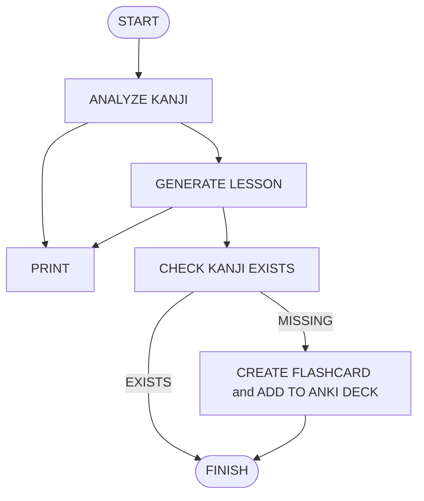
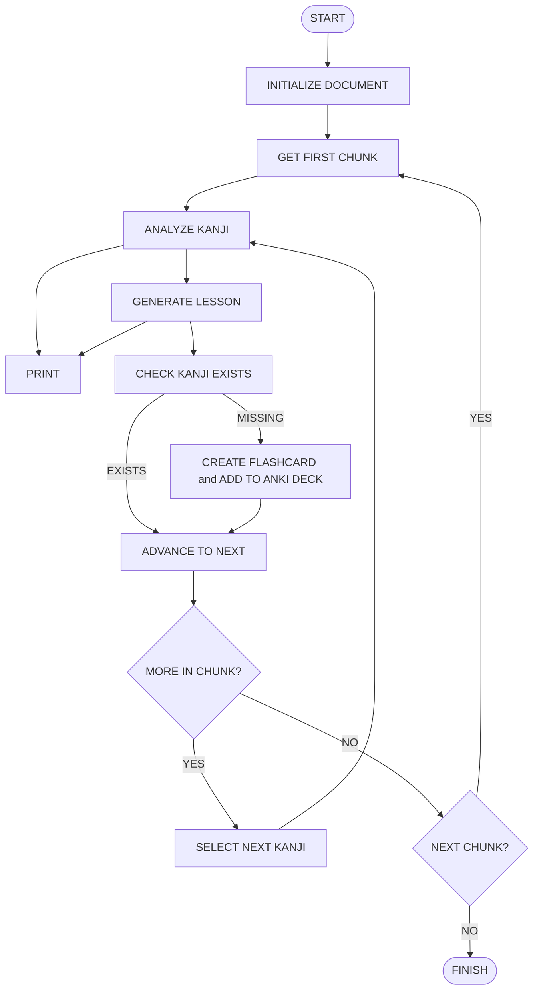

# NihonGen

> VERSION 3 (Interactive Kanji Tutor) — 🚧 IN PROGRESS. See [`docs/SPEC.md`](docs/SPEC.md) and [`docs/PLAN.md`](docs/PLAN.md).

## Setup

1. Install Anki desktop + the [AnkiConnect](https://ankiweb.net/shared/info/2055492159) add-on (code `2055492159`). Keep Anki open while running.
2. `cp .env.example .env` and set `GOOGLE_API_KEY` (and `ANKI_DECK` if not `Test_Deck1`).
3. `uv sync`
4. Run from `src/` (imports are `from graph...`, not `src.graph...`):
```bash
cd src && uv run python -m application.runner
```
5. WSL2 users: Anki runs on Windows while code runs in Linux. Enable mirrored networking so `localhost:8765` is shared — in Windows `%USERPROFILE%\.wslconfig`:
```ini
[wsl2]
networkingMode=mirrored
```
then `wsl --shutdown` and reopen. Verify with `curl -X POST http://localhost:8765 -d '{"action":"version","version":6}'` (expect `{"result":6,...}`). Keep AnkiConnect's `webBindAddress` at `127.0.0.1`.
6. Tests: `uv run pytest` (uses `pythonpath=["src"]`).
7. Dictionary index (one-time setup): download KANJIDIC2 (`kanjidic2.xml.gz`) and JMdict (`JMdict_e.gz`) from the [EDRDG site](https://www.edrdg.org) into `data/`, unzip, then build the local index:
```bash
cd src && uv run python -m infrastructure.build_dictionary
```
This creates `data/dictionary.sqlite` (gitignored). Kanji facts come from this DB, never from the LLM.

## Dictionary data

Kanji readings, meanings, stroke counts and example words come from [KANJIDIC2 and JMdict](https://www.edrdg.org), (c) Electronic Dictionary Research and Development Group, used under CC-BY-SA. The raw XML and built index live only in local `data/` and are not committed.

---

VERSION 1
────────────────────────
Basic Anki automation   ✅ COMPLETE



VERSION 2
────────────────────────
Document → MCP → Kanji processing → Anki    ✅ COMPLETE




VERSION 3
────────────────────────
Interactive Kanji Tutor

• Better lesson schema
• Separate system prompts
• Multi-turn conversation
• Conversation memory
• HITL
• Quiz/evaluation
• Pass/fail loop
• Only advance after passing
• User approval before Anki mutation


VERSION 4
────────────────────────
Learning Pipeline / Staging

• Holdout database
• Study batches
• e.g. 10 kanji/session
• Flashcard lifecycle
• Staged → approved → Anki
• Resume unfinished sessions


VERSION 5
────────────────────────
Adaptive Learning

• Read Anki study/progress data
• Track learner progress
• Determine active vs established kanji
• Reuse learned kanji in:
    - examples
    - conversations
    - quizzes
• Personalized lesson difficulty


VERSION 6
────────────────────────
Production Hardening

• Modular architecture
• Logging
• Testing
• Persistence
• Retry policies
• Idempotency
• Observability
• Error recovery
• Deployment