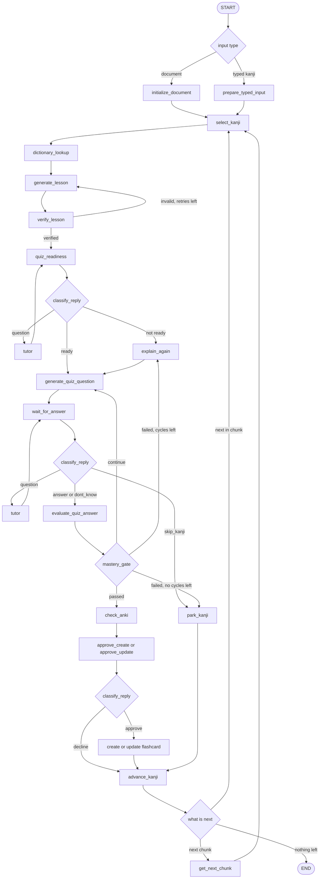

# NihonGen
> VERSION 3 (Interactive Kanji Tutor) - Complete

An interactive Kanji tutor that teaches from dictionary facts, quizzes you, and only touches your Anki deck after you've passed and approved it. Built as a deterministic LangGraph workflow with bounded autonomy where it earns it, not a free-roaming agent.

## DEMO
Demo video coming Soon...

## Why This Exists
- Anki is an SRS (spaced repetition system) based flashcard app. This gives two options, either download a pre-made kanji deck or make your own as you study and progress.
- Making your own takes a lot of time. One has to create a new card, fill up the front of it, then back of it manually. Why do so much work when AI can handle the manual labor so you can just focus on the core material.
- Pre-made decks are good, but not very intuitive and is more like of rote-learning.
- So, how about an Anki deck that grows with you as you progress in your japanese learning journey, that's where NihonGen comes in.
- It not only automates the flashcard making workflow, but also teaches you based on dictionary grounded LLM lessons, quizzes you, evaluates your answers, creates or updates the flashcard only when you approve.

-  Most AI tutors just let the LLM invent kanji readings from memory, which is how you end up with confidently wrong facts. NihonGen flips that: the LLM only write the lesson, every reading and example word comes from KANJIDIC2/JMdict first.
- And it doesn't just take your word for it that you've learned a kanji, you're quizzed on it. 5 questions covering reading and meaning, up to 2 misses, a third miss ends the quiz early and you get two more passes at it before it's set aside for later.

## What it does (features)

- **Dictionary-grounded lessons**:- KANJIDIC2/JMdict index built locally; the
  info panel is 100% dictionary-sourced.
- **Verify-then-teach**:- JMdict checks plus a dialogue judge pass; failures
  logged to `evals/verification_failures.jsonl`.
- **Structured quiz, code-owned mastery**:- 5 questions, coverage rule, early
  fail on the 3rd miss, 2 review cycles with missed-question reviews, park
  path. Every verdict unit-tested.
- **Reply routing**:- every reply classified per prompt (answer / question /
  command); questions detour to a read-only tutor and return to the same
  prompt; `unclear` re-asks; conditional approvals get a refusal reason.
- **Approval-gated Anki**:- one shared card format, before/after diffs,
  duplicate guard, structured outcomes, early deck-membership notice.
- **Session summary**:- per-kanji outcomes at the end of every run.
- **Two interfaces**:- CLI fallback and Discord threads (one thread per
  session, owner-only, attachments supported) over the same loop.
- **Deterministic control with bounded autonomy**:- LangGraph state machine with a deterministic control flow and bounded agentic component, rather than a single unconstrained agent loop. Keeping side effects behind an explicit decision point.

## How it Works

1. **Input**:- type a kanji, a word (友達), a sentence, or hand over a
   TXT/PDF document (multi-kanji documents are chunked, nothing dropped).
2. **Facts**:- readings/meanings/strokes looked up locally, zero LLM.
3. **Lesson**:- LLM-authored on verified facts: example words, usage rules, a
   labelled memory aid, a short dialogue. Romaji generated by code, never the
   model.
4. **Verify**:- every word checked against JMdict (exists, contains the
   kanji, reading matches); dialogue judged for JP/EN consistency. Retry
   twice, then drop and log.
5. **Quiz**:- readiness check, structured questions with skill coverage, free
   questions detour to a bounded tutor that never consumes a round.
6. **Gate**:- code computes pass/fail; fail reviews twice, then parks.
7. **Anki**:- existing cards announced upfront; create/update only on clean
   approval; session ends with a per-kanji summary (added/updated/parked/
   skipped/declined).

## Architecture


```mermaid
flowchart TD
    S([START]) --> RI{input type}
    RI -->|document| ID[initialize_document]
    RI -->|typed kanji| PT[prepare_typed_input]
    ID --> SK[select_kanji]
    PT --> SK
    SK --> DL[dictionary_lookup]
    DL --> GL[generate_lesson]
    GL --> VL[verify_lesson]
    VL -->|invalid, retries left| GL
    VL -->|verified| QR[quiz_readiness]
    QR --> C1{classify_reply}
    C1 -->|question| TU[tutor]
    TU --> QR
    C1 -->|not ready| EA[explain_again]
    C1 -->|ready| GQ[generate_quiz_question]
    EA --> GQ
    GQ --> WA[wait_for_answer]
    WA --> C2{classify_reply}
    C2 -->|question| TU2[tutor]
    TU2 --> WA
    C2 -->|answer or dont_know| EV[evaluate_quiz_answer]
    C2 -->|skip_kanji| PK[park_kanji]
    EV --> MG{mastery_gate}
    MG -->|continue| GQ
    MG -->|failed, cycles left| EA
    MG -->|failed, no cycles left| PK
    MG -->|passed| CA[check_anki]
    CA --> AP[approve_create or approve_update]
    AP --> C3{classify_reply}
    C3 -->|approve| MU[create or update flashcard]
    C3 -->|decline| AK[advance_kanji]
    MU --> AK
    PK --> AK
    AK --> RC{what is next}
    RC -->|next in chunk| SK
    RC -->|next chunk| GC[get_next_chunk]
    GC --> SK
    RC -->|nothing left| E([END])
```

## Directory Structure

```
NihonGen/
├── src/
│   ├── graph/                  # deterministic controller
│   │   ├── nodes/              # one file per concern: input, document, kanji, verify, quiz, reply, tutor, anki
│   │   │   ├── anki.py
│   │   │   ├── document.py
│   │   │   ├── input.py
│   │   │   ├── kanji.py
│   │   │   ├── quiz.py
│   │   │   ├── reply.py
│   │   │   ├── tutor.py
│   │   │   └── verify.py
│   │   ├── builder.py          # wiring: 21 nodes, 8 routers
│   │   ├── routing.py          # every branch lives here
│   │   ├── state.py            # shared blackboard (23 fields)
│   │   ├── context.py          # live services (MCP, models, dictionary, Anki, config)
│   │   ├── checkpointer.py     # MemorySaver + serde allowlist
│   │   └── helpers.py          # pre-pass, labels, kanji extraction, hints
│   ├── infrastructure/         # side-effect gateways (no graph logic)
│   │   ├── anki.py             # AnkiClient + card formatting
│   │   ├── build_dictionary.py # EDRDG XML → data/dictionary.sqlite
│   │   ├── dictionary.py       # read-only DictionaryService
│   │   └── romaji.py           # code-generated romaji (pykakasi)
│   ├── application/            # I/O seam (no graph logic)
│   │   ├── runner.py           # CLI loop: render/collect/resume
│   │   ├── discord_bot.py      # /learn threads, owner gate, shared MCP session
│   │   ├── channel.py          # Channel protocol: CLI / Discord / fake
│   │   ├── renderer.py         # pure string rendering
│   │   └── config.py           # BaseSettings (.env)
│   ├── llm/                    # models + system prompts
│   │   ├── model.py
│   │   └── system_prompts.py
│   ├── domain/                 # Pydantic contracts
│   │   └── generation_schema.py
│   ├── tests/                  # 171 tests (routing, quiz, reply, verify, Anki, …)
│   │   ├── test_anki.py
│   │   ├── test_channel.py
│   │   ├── test_dictionary.py
│   │   ├── test_discord.py
│   │   ├── test_input.py
│   │   ├── test_quiz.py
│   │   ├── test_reply.py
│   │   ├── test_routing.py
│   │   ├── test_session.py
│   │   ├── test_tutor.py
│   │   └── test_verify.py
│   ├── mcp_server.py           # document extraction over MCP
│   └── practice.txt            # sample input
├── docs/
│   ├── SPEC.md                 # why things are this way
│   ├── PLAN.md                 # day-by-day build order
│   └── PARKED.md               # deferred to V4/V5
├── evals/
│   ├── RESULTS.md              # banked eval numbers
│   ├── reply_*.jsonl           # 65 labelled reply rows (3 prompts)
│   ├── check_replies.py        # offline + --llm accuracy checker
│   └── *_failures.jsonl, reply_log.jsonl  # runtime logs (gitignored)
├── data/                       # KANJIDIC2/JMdict XML + dictionary.sqlite (gitignored)
├── .env.example
├── pyproject.toml
└── uv.lock
```

## Tech Stack
#### Runtime / orchestration
- Python ≥3.13, managed with uv (+ uv.lock)
- LangGraph - deterministic graph controller, interrupts, MemorySaver checkpoints
- LangChain + langchain-google-genai - LLM bindings, structured output, tool calling (tutor)
- Model: Gemini 3.5 Flash Lite (single small model for lessons, examiner, grader, classifier, tutor, judge)
#### Data / validation
- Pydantic v2 - all domain contracts; pydantic-settings for .env config
- SQLite - local KANJIDIC2/JMdict index (data/dictionary.sqlite)
- pykakasi - offline kana -> romaji (Hepburn)
- EDRDG KANJIDIC2 + JMdict (CC-BY-SA) - the fact source
#### Interfaces
- AnkiConnect (local HTTP, urllib) — the only Anki coupling; deck Test_Deck1
- MCP (mcp<2.0, stdio) - document extraction server + in-process client
- discord.py 2.7 - /learn threads, owner gate
- pypdf - PDF input path; python-dotenv — local config
Dev
- pytest (171 tests, pythonpath=["src"]), ipykernel (scratch notebooks)

## Results / Evals

Banked from live runs over 19 kanji (`evals/RESULTS.md`):

- **0 invalid example words shown**, with 1 drop (`京都市`, genuinely absent) and 4 dialogue flags (all genuine catches) proving the filter works.
- **Classifier 60/65 (92%)** on the 62 committed reply rows; all 5 misses are stricter-than-reality `unclear` rows, not model errors.
- **Quiz sanity**: observed passes plus a forced park (3 misses → 2 reviews → parked, zero Anki calls); gate matrix green in-suite.

Rerun: `uv run python evals/check_replies.py` (offline pre-pass) and `--llm` (full classifier, needs key).

## Configuration

| Key | Default | Purpose |
|---|---|---|
| `GOOGLE_API_KEY` | - | LLM for lessons, quiz, tutor, judge, classifier |
| `ANKI_DECK` | `Test_Deck1` | Target deck for all card operations |
| `ANKI_URL` | `http://127.0.0.1:8765` | AnkiConnect endpoint |
| `DICT_PATH` | `data/dictionary.sqlite` | Local dictionary index |
| `DISCORD_TOKEN` | - | Bot token (empty = bot disabled) |
| `DISCORD_OWNER_ID` | `0` | Your user ID, only this user can play |
| `DISCORD_CHANNEL_ID` | `0` | Restrict `/learn` to one channel (`0` = anywhere) |

## Setup

1. Install Anki desktop + the [AnkiConnect](https://ankiweb.net/shared/info/2055492159) add-on (code `2055492159`). Keep Anki open while running.
2. `cp .env.example .env` and set `GOOGLE_API_KEY` (and `ANKI_DECK` if not `Test_Deck1`). Python 3.13 via `uv`.
3. `uv sync`
4. Dictionary index (one-time): download KANJIDIC2 (`kanjidic2.xml.gz`) and JMdict (`JMdict_e.gz`) from the [EDRDG site](https://www.edrdg.org) into `data/`, unzip, then:
```bash
cd src && uv run python -m infrastructure.build_dictionary
```
This creates `data/dictionary.sqlite` (gitignored). Kanji facts come from this DB, never from the LLM.


5. Run from `src/` (imports are `from graph...`, not `src.graph...`):
```bash
cd src && uv run python -m application.runner
```
6. Tests: `uv run pytest` (uses `pythonpath=["src"]`).
7. WSL2 users: Anki runs on Windows while code runs in Linux. Enable mirrored networking so `localhost:8765` is shared — in Windows `%USERPROFILE%\.wslconfig`:
```ini
[wsl2]
networkingMode=mirrored
```
then `wsl --shutdown` and reopen. Verify with `curl -X POST http://localhost:8765 -d '{"action":"version","version":6}'` (expect `{"result":6,...}`). Keep AnkiConnect's `webBindAddress` at `127.0.0.1`.

## Discord bot

1. Create an application in the [Discord developer portal](https://discord.com/developers/applications), add a bot, copy its token into `DISCORD_TOKEN`.
2. Enable the **Message Content** privileged intent (Bot page) — the bot reads thread replies to advance the session.
3. Invite with `bot` + `applications.commands` scopes.
4. Set `DISCORD_OWNER_ID` to your numeric user ID (only you can start sessions or answer; everyone else is ignored). Optional `DISCORD_CHANNEL_ID` restricts `/learn` to one channel.
5. Run: `cd src && uv run python -m application.discord_bot`, then `/learn text:友達` (or attach a TXT/PDF) in your server.

## Dictionary Data / Attribution

Kanji readings, meanings, stroke counts and example words come from [KANJIDIC2 and JMdict](https://www.edrdg.org), (c) Electronic Dictionary Research and Development Group, used under CC-BY-SA. The raw XML and built index live only in local `data/` and are not committed.

## Limitations

- **Quiz-variety hardening.** Word-exclusion + retry reduced repeats, but a
  stubborn examiner can still circle one word (observed: 何時 4/5). Options:
  hard reject-and-regenerate, or one-question-per-word dealt like cards.
- **Romaji spacing.** Pykakasi segment joins leave `space before punctuation`
  (`ima , nanji desuka .`). Post-process segments in `infrastructure/romaji.py`.
- **Gloss selection.** Truncation keeps the first 3 JMdict glosses, but the
  first gloss isn't always the primary sense (e.g. 人 → `-ian …`). Prefer the
  gloss matching the kanji meaning, or curate per grade.
- **Unclear-loop cap.** Repeated `unclear` at any gate re-asks forever.
  Decide: Nth unclear -> decline/park with a notice.
- **SqliteSaver.** `MemorySaver` drops open sessions on restart (accepted for
  V3 per SPEC). Swap checkpointer for durable sessions.
- **Tutor upgrade.** Raise the 3-call budget, add example-sentence lookup,
  let it compose drills on request. Read-only bounds stay.
- **Answer-with-`?` at quiz.** `mizu, am I right?` routes to tutor, not the
  grader. Needs grammar-aware pre-pass or classifier few-shots; logged via
  `reply_log.jsonl` for evidence.

## Version History and future Roadmap

- **V1** - basic Anki automation. ✅ COMPLETE
- **V2** - document → MCP → kanji → Anki pipeline. ✅ COMPLETE
- **V3** - interactive tutor (this README): verified lessons, structured quiz with code mastery gate, reply routing with tutor, approval-gated Anki, CLI + Discord. ✅ COMPLETE (`v0.3.0`)
- **V4 (planned)** - staging/holdout DB, study batches, resumable sessions.
- **V5 (planned)** - adaptive difficulty from Anki progress.
- **V6 (planned)** - production hardening: persistence, retries, observability.

## License
Link to [LICENSE](https://github.com/hari-vash/NihonGen/blob/main/LICENSE)
