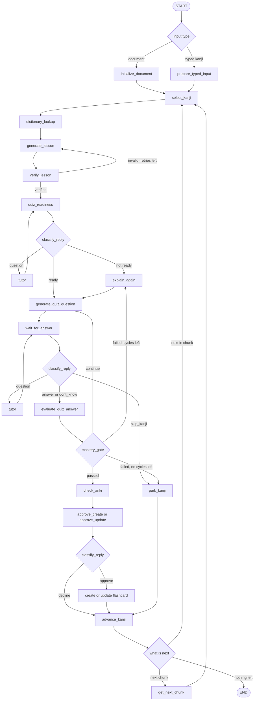

# NihonGen V3: Product and Technical Specification

Status: draft v1, 19 Sep 2026. Baseline: `main` at commit `054d99d` (code last changed in `5ce70ab`, "Refactored CLI Renderer").
Companion document: [`PLAN.md`](PLAN.md) (day-by-day tasks).

## 0. Decisions already made

| # | Decision |
|---|---|
| D1 | The outer LangGraph stays deterministic and owns control. Autonomy lives only inside bounded nodes. |
| D2 | Interface is Discord. No website or webapp. The CLI stays as the dev/fallback interface. |
| D3 | The tool is for people who already use Anki. It builds their own deck, which grows with them. It runs locally next to Anki (AnkiConnect listens on localhost). |
| D4 | Pass rule: 5 graded questions, at most 2 misses. |
| D5 | Every user reply is classified per prompt (answer / question / command), inside the graph. |
| D6 | Facts come from a dictionary. The LLM proposes, code verifies. |
| D7 | V4 (staging), V5 (adaptive), V6 (hardening) are out of scope for V3. |

## 1. Purpose and users

NihonGen V3 is a Discord-based Kanji tutor. The learner gives it a kanji (typed in chat) or a document. It teaches the kanji, answers questions, quizzes the learner, and only adds or updates an Anki card once the learner has passed the quiz and approved the change.

The user is an Anki user learning Japanese who runs the bot on their own machine with their own API keys.

## 2. Baseline audit (what the code does today)

Reviewed: all of `src/` (about 1,100 lines), `pyproject.toml`, `README.md`. Findings are ordered by importance.

### 2.1 What is already good (keep it)

- `State` holds workflow data and `RuntimeContext` holds live objects (`graph/context.py`).
- Checkpointer uses an explicit `JsonPlusSerializer` allowlist (`graph/checkpointer.py`).
- Side effects are behind approval nodes (`approve_create`, `approve_update`).
- MCP failures raise instead of looking like completion (`graph/helpers.py`, `parse_mcp_json`).
- The runner is already async and the graph is built by `build_graph(checkpointer=...)`.
- `normalize_yes_no()` (`graph/helpers.py`) is already the deterministic fast path for replies.
- Unrecognised replies re-ask instead of acting (`"clarify"` branch).

### 2.2 Findings

| ID | Sev. | Where | Finding |
|---|---|---|---|
| A1 | **Bug** | `graph/routing.py` `route_document` | After `get_next_chunk`, the graph checks `has_more`. In `mcp_server.py`, `has_more` means "more chunks *after* this one". So the **final chunk is never processed**: a document with 16 to 30 unique kanji silently drops the last 1 to 15. Tested documents so far have been at most one chunk (`CHUNK_SIZE = 15`). Fix: route on whether `current_chunk` is non-empty, and use `has_more` only in `route_chunk`. |
| A2 | Fragile | `application/runner.py` lines 62 to 70 | "Additional explanation" is detected from `user_decision` (never cleared, so always truthy after the first approval) plus `new_messages[0]` by index. That depends on message ordering and may render the wrong message. Replace with an explicit `pending_explanation` field set by `explain_again`. Needs a real run to confirm the exact symptom. |
| A3 | Design | `graph/routing.py` `route_quiz`, `llm/system_prompts.py` | Mastery is the LLM's per-answer `mastered` flag, so one correct answer can pass. `explain_again` resets `quiz_round` to 0 and loops back with **no cap on review cycles**. |
| A4 | Design | `application/runner.py`, `graph/state.py` | Input is a document path only (`file_path` is required, graph always starts at `initialize_document`). There is no way to start from a typed kanji. Deck name is hard-coded as `"Test_Deck1"`. |
| A5 | Design | whole graph, `tools.py` | The LLM never chooses a tool or a path. The `@tool` Anki functions are called directly as plain functions. This is a well-built workflow, not yet an agent. |
| A6 | Quality | `tools.py` | `create_kanji_flashcards` omits the lesson, `update_kanji_flashcard` includes it, and labels differ ("Kunyomi" vs "Kun'yomi"). Update shows no before/after. Errors come back as strings. Blocking `urllib` calls run inside async nodes. |
| A7 | Quality | `llm/system_prompts.py`, `domain/generation_schema.py` | Readings, example words, romaji and etymology-style notes are all LLM-authored with no verification. Romaji is generated by the LLM in `KanjiExample` and `MultilingualText`, which is the source of the JP/romaji/EN mismatches. |
| A8 | Quality | `graph/nodes/quiz.py`, `graph/state.py` | Quiz questions are unstructured free text, so question type and skill coverage cannot be tracked. `messages` grows across every kanji and is never trimmed. |
| A9 | Minor | `mcp_server.py` | Kanji are sorted by code point (not by first appearance or frequency). The regex `[\u4e00-\u9faf]` skips 々 and rarer kanji. |
| A10 | Minor | repo | Three dependency sources (`pyproject.toml`, `uv.lock`, `requirements.txt`). `pydantic-settings` is declared but unused. README has a roadmap but no setup or usage, and V3 is not marked. |

## 3. Scope

**In:** typed and document input, dictionary-grounded lessons, free-form Q&A, structured quiz with a code-based mastery gate, approval-gated Anki create/update, Discord interface, CLI fallback, evals, README.

**Out:** website, staging/holdout DB (V4), reading Anki study data and adaptive difficulty (V5), durable persistence, retries, idempotency and observability stack (V6), multi-user support.

## 4. Functional requirements

**Input and sessions**
- **FR-1** Start a session from a single kanji typed in chat.
- **FR-2** From a typed word or sentence (for example 友達), extract every kanji, dedupe, and process them in order.
- **FR-3** Start from an uploaded TXT/PDF via MCP. All chunks must be processed, including the last one (fixes A1) and one-kanji documents.
- **FR-4** At the start of each kanji, do a read-only Anki lookup so the learner is told if it is already in the deck. The create/update decision still comes after the quiz.

**Content**
- **FR-5** Kanji facts (readings, meanings, stroke count, grade) come from the dictionary, never from the LLM.
- **FR-6** The lesson is LLM-authored on top of those facts: example words, when-to-use-which-reading guidance, a mnemonic, and a short dialogue.
- **FR-7** A verification step checks the lesson. Failures trigger a retry with feedback (max 2). Anything still unverifiable is dropped and logged.
- **FR-8** Mnemonics are labelled as memory aids. No invented etymology is presented as fact.
- **FR-9** Romaji is generated by code from kana, never by the LLM.

**Chat and tutoring**
- **FR-10** The learner can ask free-form questions at any prompt. A question never consumes a quiz round or counts as a miss.
- **FR-11** Every reply is classified against the labels allowed at that prompt (section 9.2).
- **FR-12** Commands: skip this kanji, stop the session, help.

**Quiz and mastery**
- **FR-13** 5 graded questions covering at least 2 skill types, including reading and meaning/word.
- **FR-14** Each answer is graded with feedback and the correct answer is revealed.
- **FR-15** Mastery is computed in code: at most 2 misses. The 3rd miss ends the quiz early as a fail.
- **FR-16** On fail: `explain_again`, then a fresh quiz, up to 2 review cycles. After that the kanji is parked, with no Anki action.

**Anki**
- **FR-17** Use the configured deck. Read-only check first. Create and update only after explicit approval. Update shows a before/after diff. No duplicate notes. Create and update produce the same card format.
- **FR-18** If AnkiConnect is unreachable, the user gets a clear error, and it is never reported as success.

**Errors and interface**
- **FR-19** Infrastructure failure (MCP, Anki, LLM, dictionary) is never treated as success.
- **FR-20** Discord: one thread per session, owner-only allowlist, message chunking, attachment support.
- **FR-21** The CLI keeps working.
- **FR-22** At the end of a session, show a summary: passed, parked, skipped, added, updated.

## 5. Architecture

```text
Discord adapter (NEW)   CLI (existing)
          \              /
      application/runner.py     invoke graph, detect interrupt, collect reply, resume
      application/renderer.py   format only, no graph knowledge
                 |
              LangGraph          deterministic control
                 |
      nodes ── RuntimeContext ── MCP session, LLMs, DictionaryService (NEW),
                                 AnkiClient (NEW), Config (NEW)
```



`stop` from any prompt routes to a summary and END (not drawn).

Existing nodes are kept where possible. `analyze_kanji` becomes `dictionary_lookup`. `route_document` is fixed (A1).

## 6. Components and responsibilities

| Component | Type | Responsible for | Must not |
|---|---|---|---|
| Graph | Deterministic | Sequencing, loops, gates, state | Author content |
| Document processor (MCP) | Deterministic tool | Extract, dedupe, chunk kanji | Return failures as empty results |
| `DictionaryService` NEW | Code | Local KANJIDIC2 / JMdict lookups | Call the network at runtime |
| Content generator | LLM, structured output | Lesson text on top of verified facts | Invent readings or etymology |
| Verifier NEW | Code, plus a judge LLM for sentences | Check words, readings, dialogue consistency | Silently pass failures |
| Reply classifier NEW | Deterministic pre-pass, then small LLM | Return one label from the allowed set | Take actions |
| Tutor NEW | Agentic, bounded, read-only tools | Answer questions, then hand control back | Grade, advance rounds, or touch Anki |
| Examiner | LLM, structured output | Choose the next type from the allowed set, write the question, grade the answer | Decide mastery |
| Mastery gate NEW | Code | Apply the pass rule to `quiz_attempts` | Be overridden by any LLM |
| `AnkiClient` NEW | Infrastructure | Check, create, update, diff, ping | Mutate without approval |
| Runner, renderer, Discord adapter | I/O | Deliver messages, collect replies, format | Contain graph logic |

## 7. State and RuntimeContext

### 7.1 State (checkpointed)

Current fields are in `graph/state.py`. Changes:

| Field | Change |
|---|---|
| `file_path` | Becomes `NotRequired` (typed input has no file) |
| `input_mode`, `typed_text` | NEW |
| `deck` | Moves to `Config` (deployment setting, not workflow data) |
| `kanji_info` | Replaced by `dictionary_facts: KanjiFacts` (verified) |
| `lesson` | Kept; schema changes (7.3) |
| `quiz_round`, `quiz_evaluation` | Removed. `quiz_attempts: list[QuizAttempt]` is the single source of truth; the round is `len(quiz_attempts)`, mastery is a function of the attempts |
| `review_cycles` | NEW |
| `current_question` | NEW (structured `QuizQuestion`) |
| `user_decision` | Replaced by `last_reply` and `reply_intent` (transient) |
| `pending_explanation` | NEW (fixes A2) |
| `results` | NEW: per-kanji outcome for the session summary |
| `messages` | Trimmed or reset per kanji |
| `exists`, `anki_status` | `anki_status` becomes a structured `AnkiResult` |

### 7.2 RuntimeContext (live, never checkpointed)

`mcp_session`, `models` (kanji, lesson, examiner, classifier, tutor), `dictionary: DictionaryService`, `anki: AnkiClient`, `config: Config`.

Every new Pydantic type stored in State must be added to the `JsonPlusSerializer` allowlist in `graph/checkpointer.py`.

### 7.3 Data contracts (sketch)

```python
class KanjiFacts(BaseModel):        # from KANJIDIC2, never LLM-authored
    kanji: str; onyomi: list[str]; kunyomi: list[str]
    meanings: list[str]; stroke_count: int; grade: int | None

class VerifiedWord(BaseModel):      # confirmed in JMdict
    word: str; kana: str; meaning: str
    romaji: str                     # generated by code

class DialogueLine(BaseModel):
    speaker: str; japanese: str; english: str
    romaji: str                     # generated by code
    flagged: bool = False           # set by the judge pass

class KanjiLesson(BaseModel):       # LLM-authored on top of facts
    words: list[VerifiedWord]
    usage_guidelines: ReadingUsage
    mnemonic: str                   # labelled as a memory aid
    dialogue: list[DialogueLine]

class QuizQuestion(BaseModel):
    type: Literal["reading", "meaning", "word_reading", "word_meaning",
                  "in_context_reading", "onkun_choice"]
    prompt: str; expected: str

class QuizAttempt(BaseModel):
    question: QuizQuestion; user_answer: str
    outcome: Literal["correct", "miss", "dont_know"]; feedback: str

class ReplyIntent(BaseModel):
    label: str                      # constrained to the allowed set per prompt
```

## 8. Rules

### 8.1 Quiz and mastery

- 5 graded questions, at least 2 skill types, including reading and meaning/word.
- Code enforces the coverage constraint. The Examiner picks the next type from the types still allowed (for example, the last question must fill any missing required type).
- `dont_know` counts as a miss and reveals the answer. `question` and `unclear` never count.
- Pass means at most 2 misses across the 5. The 3rd miss fails early.
- Fail leads to `explain_again` (using the lesson and the missed questions), then a fresh quiz. After 2 review cycles the kanji is parked.
- Note that 3 of 5 correct is a 60% bar. Anki does the spaced repetition, so this gate means "understood enough to study", not "mastered".

### 8.2 Reply classification

| Prompt | Allowed labels |
|---|---|
| Ready for quiz? | ready, not_ready, question, stop, unclear |
| Quiz answer | answer, dont_know, question, skip_kanji, stop, unclear |
| Anki create/update approval | approve, decline, question, stop, unclear |

- Deterministic pre-pass first (extend `normalize_yes_no` with skip/stop phrases). Everything it returns as `"clarify"` goes to the small LLM classifier (structured output, low temperature).
- If the message contains an answer attempt, grade it. The "why" is covered by the explanation.
- `unclear` re-asks. At the Anki gate only a clean `approve` may mutate. Conditional replies ("ok but only readings") are `unclear`.
- Reply text is data, never instructions: "mark it mastered" is an answer, not a command.

### 8.3 Verification

- Example words must exist in JMdict, contain the target kanji, and have a matching reading.
- Romaji is generated by code from kana (for example with `pykakasi`).
- Sentence grammar cannot be fully verified by code. A separate judge pass flags JP/EN inconsistency and unnatural phrasing (such as `かばんなかに`). Flagged lines are dropped or regenerated.
- Retry with feedback at most `VERIFY_MAX_RETRIES`, then drop and log.

### 8.4 Anki

- One `format_card_back(facts, lesson)` is used by both create and update.
- Look up existing notes by the `Front` field in the configured deck. Handle AnkiConnect's duplicate error as "exists".
- Update fetches the current `Back` and shows a before/after diff for approval.
- Return structured `AnkiResult(ok, action, message)`, and never return an error as a success string.
- Keep the `Basic` note type (`Front`/`Back`) for V3. Tag notes `nihongen`.
- Run the blocking HTTP calls off the event loop (`asyncio.to_thread` or an async client).

### 8.5 Errors

Any failure of MCP, Anki, the LLM or the dictionary raises a typed error and shows the user a clear message. It never advances the workflow as if it had succeeded.

## 9. Discord behaviour

- A `/learn` command or a message in a designated channel creates a thread. LangGraph `thread_id` is `discord:<thread.id>`.
- Only `DISCORD_OWNER_ID` can start or reply to sessions. Otherwise anyone in the server can spend API credit and mutate your deck.
- Use one `asyncio.Lock` per thread so replies cannot overlap a running graph call.
- Messages over 2000 characters are chunked. Attachments are saved to a temp path and passed to the MCP document flow. The MCP server runs as a local subprocess, so paths are valid.
- Enable the Message Content intent in the developer portal.
- The bot process owns the MCP `ClientSession` for its lifetime.
- `MemorySaver` is in-memory, so a restart drops open sessions. Accept it for V3, or use `SqliteSaver` as a stretch.

## 10. Config

Use `pydantic-settings` (already in `pyproject.toml`). `.env` keys: LLM API key(s), `DISCORD_TOKEN`, `DISCORD_OWNER_ID`, `ANKI_DECK`, `ANKI_URL` (default `http://127.0.0.1:8765`), model names.

Constants: `QUIZ_MIN_QUESTIONS=5`, `QUIZ_MAX_MISSES=2`, `MAX_REVIEW_CYCLES=2`, `VERIFY_MAX_RETRIES=2`.

## 11. Acceptance tests

| ID | Scenario | Expected |
|---|---|---|
| T1 | Single typed kanji, happy path | Lesson, quiz pass, approval, card created |
| T2 | One-kanji document | Terminates cleanly |
| T3 | 3-kanji document | All processed end to end |
| T4 | 20-kanji document (2 chunks) | **All 20** processed (regression for A1) |
| T5 | Kanji already in deck | Update flow with a before/after diff |
| T6 | Question mid-quiz | Answered, round count unchanged, same question re-asked |
| T7 | "absolutely" at approval | Treated as `approve` |
| T8 | "ok but only the readings" at approval | `unclear`, re-asked, no mutation |
| T9 | Three misses | `explain_again`, fresh quiz, parked after 2 cycles |
| T10 | MCP failure | Clear error, does not look like completion |
| T11 | Anki closed | Clear error, no false success |
| T12 | Attachment via Discord | Document flow runs |
| T13 | Non-owner message | Ignored |
| T14 | Every example word in a lesson | Passes dictionary verification |

## 12. Risks

| Risk | Mitigation |
|---|---|
| Dialogue naturalness cannot be fully verified by code | Judge pass, drop flagged lines, keep dialogue short |
| Schedule | Cut list in `PLAN.md` |
| Licence of dictionary data | EDRDG data requires attribution. Check the terms and credit them in the README |
| KANJIDIC2's JLPT field uses the old 4-level scheme (as far as I know) | Do not display it as N5 to N1 |
| Restart loses open sessions (`MemorySaver`) | Accept for V3 |
| LLM rate limits on your model tier | Small models for classification, cache dictionary lookups |

## 13. Roadmap after V3

V4 staging/holdout DB and resumable sessions. V5 read Anki progress and adapt lessons. V6 persistence, retries, idempotency, observability, deployment.
